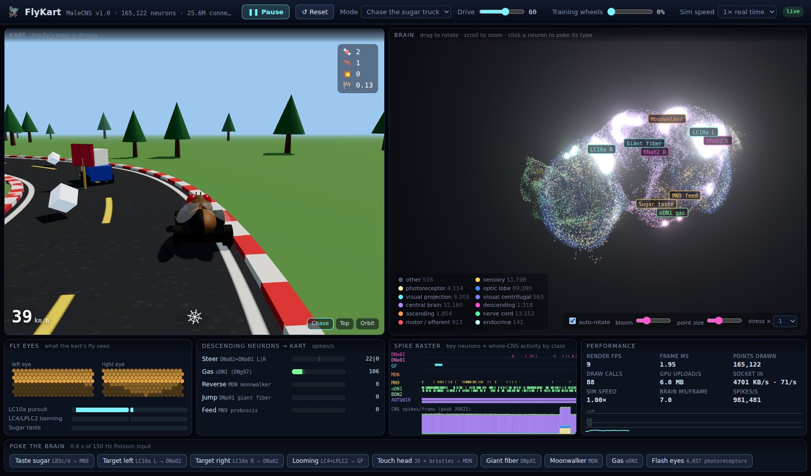

# FlyKart 🪰🏎️

**A real fruit fly's brain drives a go-kart, and you can watch it think.**



In 2026, scientists at HHMI Janelia and Google finished mapping every neuron and
every connection in the nervous system of a male fruit fly: 165,122 neurons, 25.6
million connections, and 124 million synapses. FlyKart downloads that map, turns it
into a spiking neural network on your CPU or GPU, and connects it to a kart:

- **Its eyes see the game.** The kart's view stimulates the fly's real photoreceptors
  and visual neurons.
- **Its real neurons drive.** The fly's own steering, escape and feeding neurons steer,
  jump and eat. Nobody trained anything; the behavior comes from the wiring.
- **You watch it happen.** A Three.js dashboard shows every neuron lighting up as it fires.

## Quick start

You need **git**, an **internet connection**, and about **8 GB of free disk space**
for the CUDA installation, or **3 GB** for CPU-only. NVIDIA GPUs use the existing
CUDA/Triton backend. CPUs use **Numba-compiled native kernels** and generally run
the brain in slow motion.

```bash
git clone https://github.com/ZENinjaneer/flykart.git
cd flykart
./setup.sh
uv run flykart
```

For a **CPU-only installation**, replace the last two commands with:

```bash
./setup.sh --cpu
uv run --no-group cuda --extra cpu flykart
```

Keep `--no-group cuda --extra cpu` on subsequent `uv run` and `uv sync` commands to avoid
installing CUDA packages. Plain `uv sync` / `uv run` retains the original
CUDA-enabled PyTorch default on Linux; `--device cpu` only selects execution
and does not change which packages are installed.

Then open **http://localhost:8765** in your browser and press **▶ Run**.

`./setup.sh` does everything for you:

1. Installs [uv](https://docs.astral.sh/uv/), a Python package manager, if you don't have it.
2. Installs the right Python version, the selected PyTorch build, and Numba.
   Native CPU kernels compile on first use and are then cached.
3. Downloads the fly connectome (~1.2 GB) and preprocesses it (~1 minute).
4. Checks your setup and tells you how to fix anything that's wrong.

It's safe to run again; finished steps are skipped.

### CPU execution

The CPU backend compiles Python numerical kernels to native machine code with
Numba. It runs independent neuron updates in parallel, stores spikes as compact
bitmasks, and partitions synaptic outputs so threads never write the same cell.
It keeps the full connectome and the original 0.1 ms integration step.

The default `--cpu-rng sparse` draws random stimulation only for neurons whose
input rate is nonzero. This keeps the independent stimulation probabilities but
changes trajectories for a given seed compared with the older full-array draws.
Use `uv run --no-group cuda --extra cpu flykart --cpu-rng full` for the original CPU random sequence. Reset
restarts the generator from its seed. Identical inputs reproduce the same neural
trajectory within either mode; changing the number of CPU threads does not
change that trajectory.

`FLYKART_CPU_THREADS` controls the native worker count; for example,
`FLYKART_CPU_THREADS=4 uv run --no-group cuda --extra cpu flykart`. More threads are not always faster.
Run `uv run --no-group cuda --extra cpu flykart bench --ms 200` for a short measurement on your machine.

On this Ryzen 5 220, four workers reduced warmed full-brain updates from
753 ms to 90 ms in a paired benchmark (8.4× faster). The restarted server
averaged 78 ms per 14.4 ms simulation update: about 0.185× real time, so a
simulated second still takes about 5.4 wall-clock seconds. Workload and browser
load affect these numbers; the short `bench` command measures an idle brain.
See [CPU measurements and method](docs/cpu-performance.md) for details.

Pause freezes the brain and kart, while an explicit stimulus can still exercise
the brain while paused. Reset clears the model, clock, and random sequence.
The kart panel shows actual simulation speed separately from the requested
speed limit. The brain view defaults to smoothed activity; select spike flashes
to inspect the individual update batches.

### On Windows

Use **WSL2** (Linux inside Windows):

1. Open **PowerShell as Administrator** and run `wsl --install`, then restart your PC.
2. Open the **Ubuntu** app from the Start menu and create a user.
3. Run the Quick start commands above in that Ubuntu window.

Open http://localhost:8765 in your Windows browser. For NVIDIA execution, install
the NVIDIA driver on Windows, not inside Ubuntu, and use the default setup.
Use `./setup.sh --cpu` and `uv run --no-group cuda --extra cpu flykart` without an NVIDIA GPU;
the CPU installation does not require a CUDA driver.

### On macOS

It runs on the CPU in slow motion; there's no CUDA on Macs. Install the developer tools
first if `git` is missing: `xcode-select --install`.

## Things to try

| Try this | What happens |
|---|---|
| Press **▶ Run** | The fly chases the blue sugar truck. Watch the **LC10a** labels glow while it tracks the truck, and **DNa02 L/R** flash as it turns. |
| Click **Giant fiber** (bottom row) | The fly's escape neuron fires and the kart jumps. |
| Click **Taste sugar** | Taste neurons fire the feeding motor neuron MN9 and the proboscis sticks out. |
| Click **Moonwalker** | The backward-walking neurons fire and the kart reverses. |
| Hover over the brain | See each neuron's cell type. Click to stimulate every neuron of that type. |
| **Drive** slider | How hard the fly "wants" to walk forward. |
| **Training wheels** slider | Blends in an autopilot. At 0% (the default) the fly drives alone. |
| **stress ×** menu (brain panel) | Draws up to 25 copies of the brain (4.1 million points) to see how Three.js copes. Watch the Performance panel. |

## Add your own 3D models

Put `.glb` files in `web/assets/models/` and list them in `models.json` there.
Each model can replace the kart, the truck, the obstacles or the sugar cubes, or
be placed as scenery, and gets a credit line in the kart view. The format is in
[web/assets/models/README.md](web/assets/models/README.md). Only add artwork you
have the rights to share.

## Commands

For the CPU-only installation, insert `--no-group cuda --extra cpu` after `uv run` in the examples below.

| Command | What it does |
|---|---|
| `uv run flykart` | Start the dashboard. Downloads the data first if needed. |
| `uv run flykart doctor` | Check your setup and explain how to fix problems. |
| `uv run flykart bench` | Measure how fast the brain runs on your machine. |
| `uv run flykart drive -v` | Drive without a browser and print what the neurons are doing. |
| `uv run flykart prepare --force` | Re-download and rebuild the connectome data. |
| `uv run flykart --port 9000` | Use a different port. `--host 0.0.0.0` makes it reachable from other devices. |

## How the fly drives

Each row is a real neuron type in the connectome. Every "drives" claim was checked
by stimulating the input in this model and measuring the output.

| Game event | Neurons stimulated | What the connectome does | Kart action |
|---|---|---|---|
| Truck off to one side | **LC10a** (the male "chasing" pathway), chosen by where in the visual field each one looks | LC10a → **DNa02** on the *same* side (130–185 spikes/s) | Steer toward the truck |
| Fly-swatter about to hit | **LC4 + LPLC2** (looming detectors) | → **giant fiber** (DNp01), 250–400 spikes/s within ~10 ms | Escape jump |
| Drive over a sugar cube | **LB3c/d** taste neurons (the taste types that drive MN9 hardest in this model) | → **MN9** proboscis motor neuron | Eat ("SLURP!") |
| Crash | Antenna + bristle touch neurons | → **MDN** "moonwalker" neurons | Reverse |
| Drive slider | **oDN1** forward-walking neuron | Slowed by the chasing circuit (AOTU019) and by feedback | Gas |
| What the kart sees | ~4,100 photoreceptors | The optic lobes light up | Eye candy only |

Some behaviors nobody programmed:

- **It turns in sharp jerks rather than smoothly.** It holds course while the truck is
  ahead and turns hard once the truck drifts about 30° to the side.
- **It slows down to turn.** The chasing circuit inhibits the forward-walking neuron.
- **It cuts corners across the grass.** It's chasing a truck, not following a road.

## Honest caveats

- **The neurons are simplified.** They're "leaky integrate-and-fire" model neurons (from
  Shiu et al., *Nature* 2024). Connection strength = number of synapses. There's no
  biochemistry, no learning, no hormones.
- **Excitatory vs. inhibitory is a simple rule.** GABA and glutamate count as
  inhibitory, everything else as excitatory. That makes photoreceptors *excite* their
  targets, when in real flies light inhibits them. So the eyes are driven by
  darkness, which makes the next layer respond the way it does in a real fly.
- **The senses are hand-built.** The retina is coarse. Looming uses time-to-contact.
  The chasing neurons' receptive fields are modeled as blurry 40° spots.
- **Speed comes from outside.** The Drive slider feeds the forward-walking neuron
  directly, which is also how Eon Systems drove their virtual fly.
- **The kart is game physics, not a fly body.** For a real fly-body simulation, see
  [FlyGym / NeuroMechFly](https://github.com/NeLy-EPFL/flygym).

## Troubleshooting

Run `uv run flykart doctor` first (`uv run --no-group cuda --extra cpu flykart doctor` for CPU-only).
It checks everything below.

- **`uv: command not found` right after setup:** open a new terminal, or run
  `source $HOME/.local/bin/env`.
- **The kart moves in slow motion:** check the actual simulation speed in the kart
  panel and run `uv run flykart bench --ms 200`. The speed limit cannot make an
  overloaded simulation run faster. CUDA being unavailable is expected with the
  CPU-only installation.
- **"Port 8765 is already in use":** FlyKart is probably already running in another
  terminal. Stop it with Ctrl+C, or use `uv run flykart --port 8766`.
- **The page won't load from Windows (WSL2):** start with `uv run flykart --host 0.0.0.0`
  and open `http://<address>:8765`, using the first address printed by `hostname -I`.
- **The download got interrupted:** just run `./setup.sh` again.
- **Blank or black brain panel:** your browser needs WebGL2. Use a current Chrome,
  Edge or Firefox with hardware acceleration turned on.

## Performance

Measured on an RTX 5090 Laptop GPU under WSL2:

| | |
|---|---|
| Brain speed | 3.4× faster than real time, or 3.0× with the eyes active (`flykart bench`) |
| GPU memory | about 240 MB for the whole nervous system |
| Disk | ~5.5 GB Python environment, 1.1 GB raw data, 160 MB processed |
| Timing | 0.1 ms time steps; brain and kart sync every 14.4 ms |

Why it's fast: a spike takes exactly 18 time steps to reach the next neuron, so
FlyKart advances every neuron 18 steps at once in one GPU kernel (written in
Triton). A second kernel then passes the spikes along, skipping the many neurons
that stayed silent. That's about 4× faster than a standard sparse matrix
multiply. The result matches a plain-PyTorch version spike for spike, and that
version is also the fallback for computers without Triton.

## Project layout

```
setup.sh            one-command setup
flykart/
  connectome.py     downloads + preprocesses the connectome
  brain.py          the spiking neuron model + GPU kernels
  interface.py      game senses → neurons → kart controls
  world.py          track, kart physics, truck, obstacles, the fly's-eye image
  server.py         web server; streams the simulation to the browser
  cli.py            the `flykart` command
web/
  index.html, style.css
  js/brainView.js   3D neuron cloud (Three.js points, glow shader, bloom)
  js/kartView.js    3D kart scene
  js/dashboard.js   eyes, motor, raster and performance panels
  js/models.js      loads optional artist models (.glb) from assets/models
  js/main.js        connects the page to the simulation
  assets/models/    drop-in 3D models + models.json manifest
  vendor/three/     Three.js r186 (MIT license), so you don't need Node.js
```

## Credits and license

- **Connectome:** MaleCNS v1.0 from HHMI Janelia FlyEM, Google Research, the University
  of Cambridge and MRC LMB. License CC-BY 4.0. Downloaded by `setup.sh`, not included
  in this repo. <https://male-cns.janelia.org>
- **Neuron model:** Shiu et al., "A Drosophila computational brain model reveals
  sensorimotor processing", *Nature* (2024).
- **Inspiration:** Eon Systems' embodied fruit-fly brain emulation (2026).
- **Three.js:** MIT license. See `web/vendor/three/LICENSE`.
- **FlyKart code:** MIT license. See [LICENSE](LICENSE).
